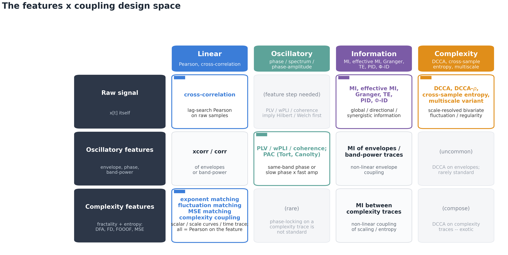
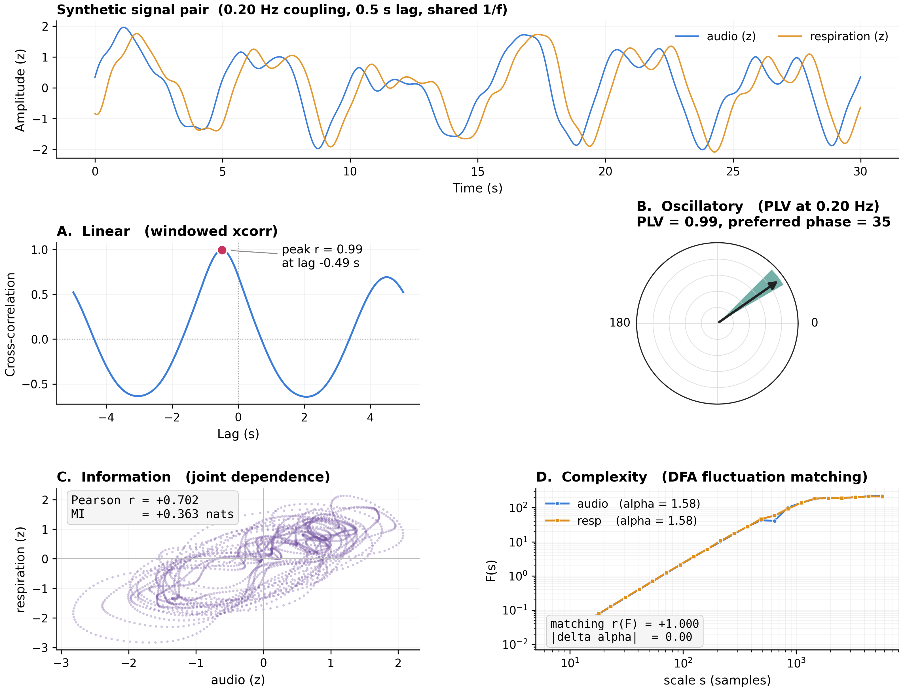
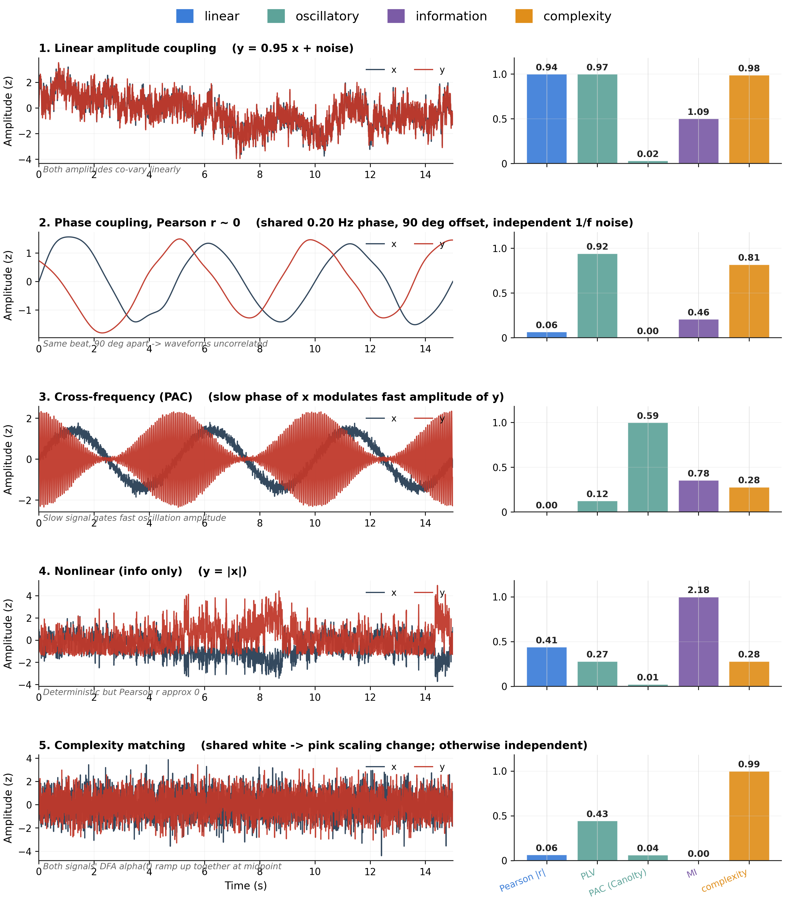

# HumanNatureAttunement

Exploring the neurophysiology of human attunement to nature through
multimodal coupling between sensory input (audio, video) and physiological
output (EEG, ECG/HRV, respiration).

The repository contains the **HNA Python toolbox** for multimodal coupling
analysis, the data-processing scripts of the *Multisensory Synchronization
as Mechanism of Nature Connectedness* project, and a preliminary results
report from the pilot dataset (n=5, sea-coast field recordings on the
coasts of Chile and Mallorca, Spain).

## Repository layout

```
HumanNatureAttunement/
├── src/HNA/                ← the HNA toolbox (importable as ``HNA``)
│   ├── dsp.py              generic signal-processing primitives (filters, envelope, NaN, resample)
│   ├── coupling/           four-family coupling subpackage
│   │   ├── linear.py       windowed cross-correlation (time-domain Pearson alignment)
│   │   ├── oscillatory.py  coherence + PLV/wPLI + PAC (Tort MI, Canolty MVL, comodulogram)
│   │   ├── information.py  MI + effective MI + Granger + transfer-entropy stub
│   │   ├── complexity.py   exponent / fluctuation / MSE matching + complexity_coupling
│   │   └── _plots.py       shared plot helpers (alignment, coupling-over-time, coherence)
│   ├── features/           modality-agnostic feature extraction (PSD, entropy, fractal, FOOOF)
│   │   ├── psd.py / entropy.py / fractal.py / aperiodic.py
│   │   └── windowed.py     generic windowed_channel_features iterator
│   ├── modalities/         per-signal cleaners + extractors
│   │   ├── audio.py        decompose_envelope into 12 bands
│   │   ├── eeg.py          filter_eeg (multi-channel Butterworth)
│   │   ├── respiration.py  clean_respiration (0.05-1 Hz BP + z-score)
│   │   ├── ecg.py          ECG cleaning + R-peaks + windowed HRV + HRV<->audio resampling
│   │   └── video/          spatial-scale x feature-family extractors
│   │                        (whole_image, per_patch, per_pixel, modal/DMD,
│   │                         spatial_fft, temporal_complexity, timestack,
│   │                         pipeline.quantify_video)
│   ├── surrogates.py       phase-shuffle / time-shift surrogates + generic test harness
│   ├── stats.py            Fisher z, BH-FDR, Friedman+post-hoc, Rayleigh, slope tests, cluster permutation
│   ├── viz/                plotting subpackage: style + sig helpers + forest/polar/spectrum/topomap helpers
│   ├── utils.py            data loading, alignment, condition extraction
│   └── README.md           toolbox guideline & module map
│
├── scripts/                ← thin CLI wrappers around the toolbox
│   ├── preprocessing/      01_align_and_annotate, 02_compute_audio_envelopes,
│   │                       03_merge_audio_into_tables, 04_cut_audio_by_conditions,
│   │                       05_preprocess_ecg, _diagnose_triggers
│   ├── features/           extract_eeg_features, extract_hrv_features
│   ├── analysis/           compute_eeg_audio_{coherence,correlation,mutual_information},
│   │                       compute_{hrv,resp}_audio_coupling, *_multi_envelope,
│   │                       _check_*, _diagnose_*, _verify_hrv_alignment
│   ├── stats/              run_{correlation,coherence,mi}_stats[_aggregated],
│   │                       run_correlation_significance, run_glm_analysis,
│   │                       run_gee_classification
│   └── figures/
│       ├── methods/        fig{1..7}_*  → reports/methods/figures/
│       ├── preliminary/    A_*, B_*, …, F_*, plot_*, compare_*  → reports/preliminary_results/figures/
│       └── video_v3/       framework, all_figures  → reports/video_v3/figures/
│
├── config/
│   └── subjects.json       per-subject metadata: condition order, audio sync,
│                           trigger threshold, trigger patches, status
│
├── notebooks/              live notebooks (preprocessing, EEG features, …) +
│                           legacy/ (old prototypes kept for reference)
│
├── data/                   gitignored — see project_goal.md for layout
│   └── processed/sub-XX/
│       ├── tables/         merged_annotated_with_audio.csv, hrv_features_<COND>.csv,
│       │                   coupling_<COND>.json, …
│       ├── audio/          per-condition WAVs + envelope CSV
│       └── ecg_processed/  cleaned ECG + R-peaks per condition
│
├── reports/                each report is self-contained (TeX + tracked figures)
│   ├── methods/            methods.tex + figures/Methods*.{png,pdf}
│   ├── preliminary_results/  report.tex + figures/Fig*.png + Fig_*.png + …
│   └── video_v3/           video_v3.tex + figures/v3_*.png, framework.png
│
├── results/                intermediate stats CSVs (gitignored beyond curated subset)
└── figures/                regenerable analysis-output figures (gitignored entirely)
```

## What's in the toolbox

The HNA toolbox is built around the question *"do two 1-D physiological/sensory
signals couple, and how?"* The answer depends on what kind of structure
you suspect, so the toolbox groups every coupling estimator into four
families that each ask a different question:

| Family            | Asks                                                     | Methods                                                        |
|-------------------|----------------------------------------------------------|----------------------------------------------------------------|
| **Linear**        | Do amplitudes co-vary linearly, with possible lag?       | windowed cross-correlation                                     |
| **Oscillatory**   | Are they synchronised in phase / share a band?           | Welch coherence, PLV, wPLI, PAC (Tort MI, Canolty MVL)         |
| **Information**   | Is there *any* (also non-linear) dependence, with direction? | MI, effective MI (bias-corrected), Granger, transfer entropy   |
| **Complexity**    | Do their *scaling* statistics match?                     | exponent / fluctuation / MSE matching, alpha-trace coupling    |

All families share a windowed estimator API and plug into the same
surrogate-test (`HNA.surrogates.surrogate_test`), cluster-permutation
(`HNA.stats.cluster_permutation_paired_1d`), and paper-style plotting
(`HNA.viz.*`) infrastructure.

Per-modality preprocessing and modality-agnostic feature extraction
(PSD bands, entropy, fractal exponents, FOOOF aperiodic) are kept in
their own subpackages — see [`src/HNA/README.md`](src/HNA/README.md) for
the full module map.

## Methods report — visual tour

The first three figures of [`reports/methods/methods.tex`](reports/methods/methods.tex)
give a visual entry point to the coupling framework.

### Fig 1 — The features × coupling design space



A 3 × 4 grid: feature rows (raw signal / oscillatory features /
complexity features) crossed with coupling-method columns (linear /
oscillatory / information / complexity). Every coupling analysis lives
in exactly one cell. Bold cells name canonical methods shipped in the
HNA toolbox; the figure also makes two identities visible —
"complexity coupling" is just *linear* coupling on a *complexity*
feature, and PAC is *oscillatory* coupling between two *oscillatory*
features.

### Fig 2 — Each coupling family on the same synthetic pair



A constructed audio-vs-respiration pair coupled at 0.20 Hz with a 0.5 s
phase lag, viewed through one canonical estimator per family:
cross-correlation (linear), PLV (oscillatory), MI / Pearson scatter
(information), and fluctuation-curve overlap (complexity).

### Fig 3 — Five clear coupling scenarios



Five synthetic signal pairs, each constructed to exemplify a single
coupling structure (linear, $90^\circ$ phase-locked, cross-frequency
PAC, non-linear / information, complexity-matched). Each row's
single-method peak corresponds to the family it was built to test —
the take-home is that no single metric is "best" across coupling types.

## Showcase — video modality features

A short clip showing **oscillatory** and **complexity** features
extracted live from the video modality of a sea-coast recording. The
video frames feed into `HNA.modules.video` to produce 1-D feature
traces that plug into the same coupling / surrogate / stats / viz
infrastructure used for audio, EEG, ECG, and respiration.

https://github.com/user-attachments/assets/a34a3a87-b420-4da9-9430-ad9d099fa613

Full-quality download (75 MB):
[showcase_compare-01_web.mp4](https://github.com/marestarellas/HumanNatureAttunement/releases/download/media-v1/showcase_compare-01_web.mp4).

## Pipeline at a glance

```
raw EEG / ECG / respiration / audio
        │
        ▼
scripts/preprocessing/01_align_and_annotate.py
        │   per-subject trigger alignment, condition annotation
        ▼
scripts/preprocessing/02_compute_audio_envelopes.py
        │   12 band-organized audio envelope columns at 256 Hz
        ▼
scripts/preprocessing/03_merge_audio_into_tables.py
        │   -> data/processed/sub-XX/tables/merged_annotated_with_audio.csv
        ▼
scripts/preprocessing/04_cut_audio_by_conditions.py + 05_preprocess_ecg.py
        │   per-condition WAVs, cleaned ECG + R-peaks
        ▼
scripts/features/extract_eeg_features.py + extract_hrv_features.py
        │   PSD band-power + entropy + (FOOOF aperiodic)  via HNA.features
        │   HRV time series                               via HNA.modalities.ecg
        ▼
scripts/analysis/compute_*_coupling.py + compute_eeg_audio_*.py
        │   any of the 4 coupling families, per (subject, condition)
        ▼
scripts/stats/run_*.py  +  scripts/figures/{methods,preliminary,video_v3}/*
        │   LMMs, Friedman + Wilcoxon post-hoc, cluster permutation,
        │   paper-ready figures
        ▼
reports/preliminary_results/report.tex
```

The pipeline is config-driven: per-subject specifics (condition order,
audio sync time, trigger threshold, manual trigger patches) live in
`config/subjects.json` and the scripts default to repo-root-relative paths
(`<repo>/data`, `<repo>/results`, `<repo>/figures`) with explicit
`--data-dir` / `--results-dir` / `--figures-dir` CLI overrides.

## Running the full pilot pipeline

```bash
DATA="/path/to/data"
PYTHONPATH=src

# Stage 0 — preprocessing
python scripts/preprocessing/01_align_and_annotate.py        --subjects 02 03 04 05 06 --data-dir "$DATA" --overwrite
python scripts/preprocessing/02_compute_audio_envelopes.py   --subjects 02 03 04 05 06 --processed-dir "$DATA/processed" --overwrite
python scripts/preprocessing/03_merge_audio_into_tables.py   --subjects 02 03 04 05 06 --savepath "$DATA/processed" --overwrite
python scripts/preprocessing/04_cut_audio_by_conditions.py   --subjects 2 3 4 5 6 --data-dir "$DATA"
python scripts/preprocessing/05_preprocess_ecg.py            --subjects 2 3 4 5 6 --data-dir "$DATA" --overwrite

# Stage 1 — features
python scripts/features/extract_eeg_features.py              --subjects 02 03 04 05 06 --data-dir "$DATA"
python scripts/features/extract_hrv_features.py              --subjects 2 3 4 5 6 --data-dir "$DATA" --overwrite

# Stage 2 — coupling
python scripts/analysis/compute_resp_audio_coupling.py       --subjects 02 03 04 05 06 --data-dir "$DATA" --overwrite
python scripts/analysis/compute_hrv_audio_coupling.py        --subjects 02 03 04 05 06 --data-dir "$DATA" --overwrite
python scripts/analysis/compute_resp_audio_multi_envelope.py --subjects 2 3 4 5 6 --data-dir "$DATA"
python scripts/analysis/compute_eeg_audio_correlation.py     --subjects 2 3 4 5 6 --conditions VIZ AUD MULTI RS1 RS2 --data-dir "$DATA"

# Stage 3 — figures (see scripts/figures/{methods,preliminary,video_v3}/)
python scripts/figures/preliminary/A_spectrum_overlay.py     --subjects 2 3 4 5 6 --conditions VIZ AUD MULTI --data-dir "$DATA"
python scripts/figures/preliminary/nature_vs_rest.py         --subjects 2 3 4 5 6 --modalities resp hrv_meannn hrv_meannn_swell_0p1 --data-dir "$DATA"
```

## Methods-suite figures

Four standalone, paper-ready figures built on synthetic signals — they
explain *what each coupling family detects* without depending on the
pilot dataset. Useful as the methods section of a paper or as a
teaching reference.

```bash
PYTHONPATH=src python scripts/figures/methods/fig1_coupling_families.py
PYTHONPATH=src python scripts/figures/methods/fig2v2_sensitivity.py
PYTHONPATH=src python scripts/figures/methods/fig3_coupling_cases.py
PYTHONPATH=src python scripts/figures/methods/fig4_cases_with_psd.py
PYTHONPATH=src python scripts/figures/methods/fig5_framework.py
PYTHONPATH=src python scripts/figures/methods/fig6v2_worked_example.py
PYTHONPATH=src python scripts/figures/methods/fig7_complexity_info_families.py
```

| Figure | Purpose |
|---|---|
| `reports/methods/figures/Methods1_coupling_families.{png,pdf}` | One synthetic audio-vs-respiration pair shown four ways — one canonical estimator from each family (xcorr, PLV, MI, fluctuation matching). All four panels fire on the same coupling. |
| `reports/methods/figures/Methods2_sensitivity_matrix.{png,pdf}` | Heatmap of nine methods × six signal-pair types with known coupling structure. Column-normalized raw metric values; the diagonal pattern shows which method peaks on which kind of coupling. |
| `reports/methods/figures/Methods3_coupling_cases.{png,pdf}` | Five coupling scenarios (linear, phase-only, PAC, nonlinear, complexity-matched) shown side-by-side with each method's response — demonstrates that no single metric is "best", and that different families pick up different structures. |
| `reports/methods/figures/Methods4_cases_with_psd.{png,pdf}` | Same five cases as Fig 3 but with an extra Welch PSD + FOOOF aperiodic / peak panel per row. Surfaces the *spectral signature* of each coupling type — particularly informative for complexity matching, where the only similarity between signals is their 1/f exponent. |

## Building the preliminary report

```bash
cd reports/preliminary_results
tectonic -X compile report.tex
# → report.pdf  (≈11 MB; gitignored, regenerated locally)
```

`tectonic` auto-downloads the necessary LaTeX packages on first run. Install
with `conda install -c conda-forge tectonic` or `cargo install tectonic`.

## Documentation

- [`src/HNA/README.md`](src/HNA/README.md) — toolbox guide:
  module map, coupling-method table, surrogate testing recipe, plotting
  style, guidelines for adding new modalities.
- [`REPORT.md`](REPORT.md) — narrative project status + reproduction instructions.
- [`reports/preliminary_results/report.tex`](reports/preliminary_results/report.tex) —
  the formal preliminary-results report (LaTeX source).

## Authors

Antoine Bellemare-Pepin, Mar Estarellas, Karim Jerbi, Michael Lifshitz.

## License

MIT.
